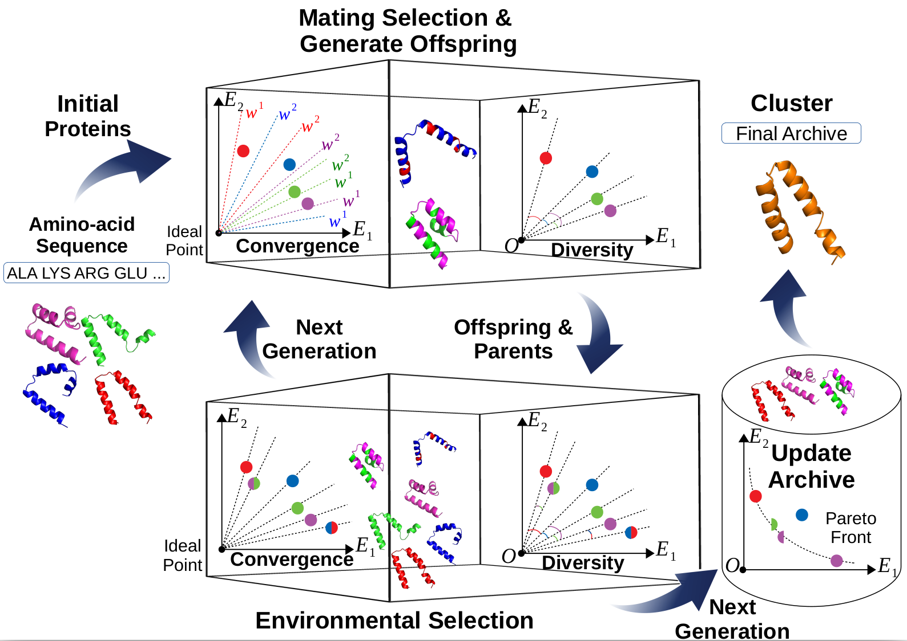

# PCM-Protein-Structure-Prediction

This is a protein structure prediction project using a many-objective evolutionary algorithm, namely PCM. In this study, protein structure prediction is treated as a many-objective optimization problem and four conflicting energy functions are used as different objectives to be optimized. A novel Pareto-dominance-archive and Coordinated-selection-strategy-based Many-objective-optimizer (PCM) is proposed to perform the conformation search. In it, convergence and diversity-based selection metrics are used to enable PCM to find near-native proteins with well-distributed energy values, while a
Pareto-dominance-based archive is proposed to save more potential conformations that can guide the search to more promising conformation areas.  

<h3></h3>  

## Requirements

* Python 3.6 or higher is required.
* Ubuntu 16.04 or higher is required.
* The details of python package is listed in [requirements.txt](./requirements.txt).
## Usage
A simple example for PCM predicting protein (ID: 1ZDD) with energy functions, bond, dDFIRE, Rosetta, and RWplus.
```
python main.py --config ./config/config_PCM_1ZDD.json --energy_config ./config/energy_config.json --protein_config ./config/protein_config.json
```

## Project Structure
```
PCM-Protein-Structure-Prediction
    │── bin\                                   // External binary files folder
    │    │──params\                            // Directory contains parameter files used by binary files 
    │    │──analyze  
    │    │──calRWplus  
    │    │──protein 
    │    │──dDFIRE
    │    │──EDTSurf
    │    │──TMscore 
    │    └──xyzpdb
    │── config\                                // Config files
    │    │──config_PCM_1ZDD.config             // The test PCM config for protein 1ZDD
    │    └──energy_config.config               // The config file of energy functions used in PCM     
    │── energy\                                // Energy function folder
    │    │──Charmm.py                          // Charmm enegrgy function in Python version 
    │    └──energy.py                          // The integration of energy functions' usages 
    │── search\                                // The MaOEA diretory
    │    ├──MOEA.py                            // The basic class of many-objective evolutionary algorithm
    │    └──PCM.py                             // The algorithm of PCM
    │── utils\                                 // Utils folder
    │    ├──LogUtils.py                        // Log generation
    │    ├──protein_config.json                // The config file of protein structure
    │    ├──protein_distance.py                // For calculating the distance of protein structure
    │    └──ProteinUtils.py                    // Protein and residue structure
    │── logs\                                  // Project log folder
    │── main.py                                // The entry point of all project
    └── requirements.txt                       // The list of required python packages
```


### Citing PCM

Z. Zhang, S. Gao, Z. Lei, R. Xiong and J. Cheng, "Pareto Dominance Archive and Coordinated Selection Strategy-Based Many-Objective Optimizer for Protein Structure Prediction," in IEEE/ACM Transactions on Computational Biology and Bioinformatics, doi: 10.1109/TCBB.2023.3247025.

```bib
@article{zhang2023pareto,
  author={Zhang, Zhiming and Gao, Shangce and Lei, Zhenyu and Xiong, Runqun and Cheng, Jiujun},
  journal={IEEE/ACM Transactions on Computational Biology and Bioinformatics}, 
  title={Pareto Dominance Archive and Coordinated Selection Strategy-Based Many-Objective Optimizer for Protein Structure Prediction}, 
  year={2023},
  doi={10.1109/TCBB.2023.3247025}}
}
